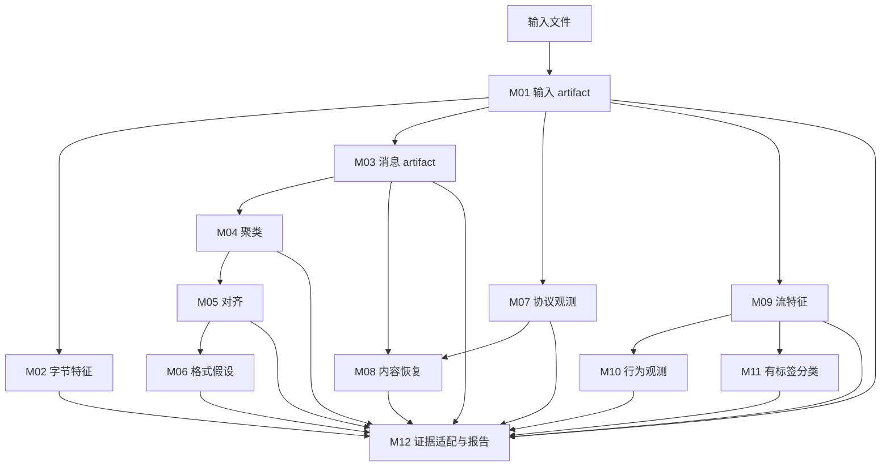
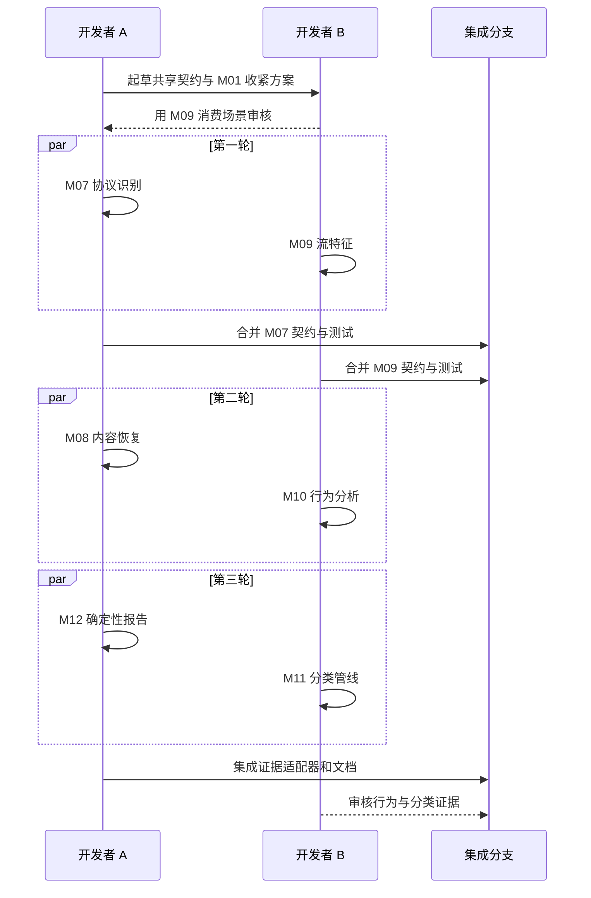

# M07～M12 两人协作开发 - Plan

> 正文使用中文。`Goal Capsule`、`Product Contract`、`Planning Contract`、`Implementation Units`、`Verification Contract`、`Definition of Done` 是下游自动化工具使用的固定章节锚点，因此保留英文。

## Goal Capsule

- **目标：** 两名开发者能够完成并在本地验证剩余分析链路，且不补造缺失的协议、时间、方向、标签、解密或语义证据。
- **方式：** 先冻结跨模块契约，再按两条互不重叠的工作线执行三轮并行开发，最后统一集成（KTD1、KTD2）。
- **权威顺序：** 本计划的产品契约定义行为；`docs/interfaces/m07-m12-interface-contracts.md` 与模块 JSON Schema 定义数据交换；模块 README 定义 CLI 用法。
- **执行特征：** 深度计划、契约优先、两人并行、模块边界测试优先。
- **停止条件：** 上游 Schema 或哈希校验失败、缺失元数据没有定义降级结果，或变更会静默改变 M01～M06 既有证据含义时，停止对应集成。
- **收尾负责人：** 指定一名集成人员更新共享文档，并在双方批准接口变更后执行全链路验证。

---

## Product Contract

### 摘要

以版本化 JSON 契约、显式证据来源和合法降级结果交付 M07～M12。第一版完整链路必须确定性、无需模型；可选 LLM 解释只能作为附加能力。

### 问题背景

M01～M06 已形成经过测试的“字节输入→格式假设”基线，但 M07～M12 仍只有调研和初步选型。剩余模块可拆为“协议与内容”和“流量与行为”两条工作线，但二者都依赖 M01；当前 M01 Schema 对 packet、flow、stream 元素约束过宽。如果不先冻结字段、缺失信息和证据引用规则，并行开发会在集成阶段返工。

计划还必须避免“框架能跑就等于分析完成”的错觉。TShark 可能不可用，课程最终 DAT 可能没有网络元数据，M11 也可能没有可信标签。因此这些条件必须成为明确状态和限制，而不是被省略或伪造；开发仍可使用合成及仓库内 fixture 独立推进。

### 需求

**共享契约与证据**

- R1. M07～M12 必须消费和生成经过版本化及校验的 JSON artifact，并记录上游路径、SHA-256、稳定记录 ID、参数、指标和警告。
- R2. M07 或 M09 集成前，必须为 M01 packet、flow、stream 增加显式 Schema 定义。
- R3. 可选元数据或工具缺失时，只要输入本身合法，就应生成机器可读的降级结果；输入非法或哈希不一致时，必须在最终输出落盘前失败。
- R4. 字节位置使用半开区间，时间单位必须明确；node 相对方向不得冒充客户端/服务端方向。

**协议与内容**

- R5. M07 必须输出基于 TShark 的标准协议观测、识别依据、可见字段、未知范围和限制；不得把端口当作协议证明，也不得把“支持加密协议”表述为“已恢复明文”。
- R6. M08 必须在安全上限内完成文本、Hex/Base64、gzip/zlib 和受支持协议对象的恢复，并保留完整转换链和来源链。
- R7. M08 必须区分协议声明/结构验证的恢复与严格候选，不得把未解密密文标为明文。

**流量与行为**

- R8. M09 只能依据实际存在的包边界、时间戳、端点和流身份计算流量特征，并列出所有不可计算特征。
- R9. M10 必须输出非互斥、可追溯的统计行为描述，不得把周期性、方向主导、突发或长连接直接解释为应用或恶意行为。
- R10. M11 只有在显式标签和固定特征定义成立时才执行防泄漏训练/评估；标签不足时输出 `insufficient_labels`，不得声称准确率。
- R11. M11 必须把应用类别和 VPN 状态作为两个任务，且不得把 M04 簇 ID 当作行为标签。

**报告与交付**

- R12. M12 必须从经过校验的 M01～M11 证据生成确定性 Markdown 报告和 manifest，且不依赖 LLM。
- R13. M12 必须分开呈现观测事实、解释假设、无法判断和后续建议；所有事实或模型陈述必须能追溯到证据 ID。
- R14. 可选 LLM 解释必须是附加、受限、可审计能力，且模型失败不能阻止确定性报告。
- R15. 每个模块必须提供 CLI、主 JSON Schema、正常与边界测试、拒绝覆盖输出目录的保护，以及重跑说明。
- R16. 两人工作边界必须避免同时编辑相同模块文件；共享文档和端到端测试采用单写者交接审核。

### 关键产品决策

- **确定性链路优先。** 首次完整交付止于模板报告；本地或托管 LLM 只有在能增加有证据约束的解释时才接入。约束 R12～R14。
- **条件不足也是合法结果。** 工具、元数据和标签缺口使用显式状态表达，不能成为伪造或静默省略分析的理由。约束 R3、R5、R8～R11。

### 成功标准

- 两名开发者都能仅依赖已冻结 fixture 独立运行自己负责的模块测试，不必等待对方实现。
- 每个跨模块 fixture 都能通过生产者 Schema 校验；源被篡改或 Schema 不兼容时，消费者可预测地失败。
- 元数据完整的抓包可分别通过 M01→M07→M08 和 M01→M09→M10，并在 M12 报告中保留完整证据链。
- 缺少包元数据的裸 DAT 在适用时仍能产生 M08/M12 结果；M07/M09/M10/M11 明确说明限制，不补造网络事实。
- 现有 58 项测试保持通过，所有新增模块与集成测试通过。

### 验收示例

- AE1. 覆盖 R3、R8～R10：M01 标记时间戳和方向不可用时，M09 输出元数据不足，M10 输出证据不足，二者均不生成时间或上传/下载特征。
- AE2. 覆盖 R5、R7：TLS 抓包只有握手字段且没有解密材料时，M07 报告握手证据，M08 明确应用明文不可恢复。
- AE3. 覆盖 R6、R7：输入包含可严格验证的 Base64，解码后为受限 gzip 成员时，M08 记录输出哈希、长度、转换顺序和确认依据。
- AE4. 覆盖 R10、R11：固定维流特征没有标签时，M11 输出 `insufficient_labels`，不生成模型或准确率指标。
- AE5. 覆盖 R12～R14：输入证据合法但模型端点不可用时，M12 仍生成确定性报告和 manifest，并记录跳过模型解释。

### 范围边界

**本次包含**

- M07/M09 所需的 M01 Schema 收紧。
- M07～M12 的 CLI、Schema、fixture、测试、README 和集成覆盖。
- 可行时优先标准库；TShark 和未来模型端点使用可选适配器。
- 明确处理元数据、依赖、标签和解密材料缺失。

**后续工作**

- 获得最终课程 DAT 后进行真实适配验证。
- 使用有代表性的标注数据评价 M11 模型质量。
- 本地模型选型、权重获取、性能调优和中文报告质量评估。
- 下载和保存大型 PCAP、HDF5 或模型文件。

**本次不做**

- 重写 Wireshark dissector。
- 在没有样本证据时猜测私有协议字段语义。
- 在没有有效密钥时破解加密，或声称高熵即可证明加密。
- 把统计模式或无监督簇当作应用身份或恶意意图真值。

---

## Planning Contract

### 关键技术决策

- KTD1. **契约优先。** `docs/interfaces/m07-m12-interface-contracts.md` 定义人类可读边界；各模块在 research 目录下维护 Draft 2020-12 JSON Schema；生产者与消费者共享已提交的契约 fixture。
- KTD2. **两条互不重叠的工作线。** 开发者 A 负责 M07、M08、M12；开发者 B 负责 M09、M10、M11。前者沿协议/内容链推进并负责最终证据汇总，后者沿流量/行为链推进。
- KTD3. **合法降级 artifact。** 可选证据缺失时使用模块状态和原因码；输入格式错误、Schema 失败和源哈希不匹配仍属于硬失败，不保留半成品目录。
- KTD4. **使用证据适配器。** M12 为每个模块提供小型规范化适配器，不建立一个耦合所有生产者的巨型共享模型。
- KTD5. **外部工具先测试替身。** TShark 和可选模型故障通过确定性 fake 覆盖；真实工具冒烟测试在能力存在时追加。
- KTD6. **共享集成面单写者。** 每轮指定一人修改 M01 Schema、`experiments/tests/`、根 README、进度和协作文档；另一人只审核，避免并发冲突。

### 高层技术设计

两条数据分支最终汇合到 M12：



两人通过契约检查点保持独立开发：



### 预期目录结构

```text
docs/{interfaces/,plans/}
experiments/M07/{run.py,README.md,tests/,fixtures/}
experiments/M08/{run.py,README.md,tests/,fixtures/}
experiments/M09/{run.py,README.md,tests/,fixtures/}
experiments/M10/{run.py,README.md,tests/,fixtures/}
experiments/M11/{run.py,README.md,tests/,fixtures/}
experiments/M12/{run.py,README.md,tests/,fixtures/}
research/M07-standard-protocols/protocols.schema.json
research/M08-recovery/recovery.schema.json
research/M09-flow-features/flow-features.schema.json
research/M10-behavior-analysis/behaviors.schema.json
research/M11-behavior-classification/classification.schema.json
research/M12-llm/{evidence.schema.json,report-manifest.schema.json}
```

### 开发轮次与交接

| 轮次 | 开发者 A | 开发者 B | 退出门槛 |
|---|---|---|---|
| 契约检查点 | 接口文档、通用封装、M01 Schema 草案 | 消费者审核、M09 特征词汇、缺失场景 | 双方批准契约 fixture；M01 基线兼容。 |
| 第一轮 | M07 | M09 | 单元、Schema、哈希不匹配和证据缺失测试通过。 |
| 第二轮 | M08 | M10 | M08 消费 M03/M07 fixture；M10 只消费已冻结 M09 契约。 |
| 第三轮 | M12 确定性报告 | M11 有条件分类 | M12 无模型可用；M11 无有效标签时不作准确率声明。 |
| 集成 | M12 适配器与报告装配 | M09～M11 集成审核 | 新旧测试通过，文档与实际证据一致。 |

消费者不得依据未经审核的生产者结构开工。检查点后若需不兼容变更，由生产者提出，消费者批准并同步更新 fixture 后才能继续通过受影响门槛。

### 风险与依赖

| 风险或依赖 | 影响 | 缓解措施 |
|---|---|---|
| 开发机没有 TShark | 无法验证真实 M07 | 必需测试使用确定性 fake；保留能力门控的真实工具测试并记录未验证环境。 |
| 最终 DAT 无抓包元数据 | M09～M11 无法形成有效网络行为证据 | 把降级状态作为一等结果；不得用消息长度冒充包特征。 |
| M11 标签不适用 | 无法产生可信模型指标 | 先交付加载、校验、分组、防泄漏和标签不足行为；真实质量声明后置。 |
| 契约漂移 | 导致晚期返工 | 每个检查点冻结 fixture，不兼容变更必须由生产者和消费者共同审核。 |
| 解压炸弹或递归编码 | 耗尽内存/磁盘 | M08 显式限制输出字节、膨胀比、递归深度和 artifact 数，并覆盖边界测试。 |
| 模型生成无证据陈述 | 破坏报告可信度 | 确定性事实为权威；校验证据引用，模型文本必须单独标识。 |
| 上游 O(n²) 结果过大 | M12 输入膨胀 | 规范化并筛选证据摘要，记录截断，不向模型传递整份密文或对齐矩阵。 |

---

## Implementation Units

### U1. 冻结共享契约并收紧 M01 记录

- **负责人：** 开发者 A 编写，开发者 B 审核。
- **目标：** 在并行开发前建立机器可读的生产者/消费者边界。
- **对应需求：** R1～R4、R16。
- **依赖：** 无。
- **文件：** `docs/interfaces/m07-m12-interface-contracts.md`、`research/M01-input/input-artifact.schema.json`、`experiments/M01/tests/test_run.py`、`experiments/tests/fixtures/contracts/`，以及确有复用价值时新增的 Schema 测试辅助代码。
- **方法：** 先为现有 M01 JSON 增加特征测试，再收紧 Schema；加入元数据完整、部分缺失和裸输入契约 fixture；统一来源与缺失原因规则。
- **测试场景：** 现有 raw、完整抓包、重传和截断结果通过；无原因的空偏移被拒绝；不存在的包引用被拒绝；源 JSON 篡改在输出创建前被发现。
- **完成判定：** M01 现有输出保持兼容，M07/M09 可只依赖契约 fixture 独立开发。

### U2. 实现 M07 标准协议识别

- **负责人：** 开发者 A。
- **对应需求：** R1、R3～R5、R15；依赖 U1。
- **文件：** `experiments/M07/run.py`、`experiments/M07/README.md`、`experiments/M07/tests/test_run.py`、`experiments/M07/fixtures/`、`research/M07-standard-protocols/protocols.schema.json`、`research/M07-standard-protocols/report.md`。
- **方法：** 把 TShark 调用封装为可注入边界，只规范化批准字段；明确 dissector、heuristic、Decode As 以及 unknown/not-applicable/tool-unavailable 状态。
- **执行说明：** 先用 fake 工具验证契约；仅在 TShark 存在时运行真实冒烟路径。
- **测试场景：** HTTP 可见字段；无密钥 TLS 仅报告元数据；非标准端口以实际字段识别；裸字节不适用；工具缺失合法降级；畸形工具 JSON 不留半成品；Decode As 明确记录。
- **完成判定：** `protocols.json` 通过 Schema，只引用真实 M01 范围，并保留工具配置和限制。

### U3. 实现 M09 流量特征

- **负责人：** 开发者 B。
- **对应需求：** R1～R4、R8、R15；依赖 U1。
- **文件：** `experiments/M09/run.py`、README、测试、fixture、`research/M09-flow-features/flow-features.schema.json`、模块报告。
- **方法：** 把长度、重传、分位数、方向和突发口径记录为参数；只计算每个流具备证据的特征，并为不可用特征给出原因码。
- **执行说明：** 使用可手算的小包序列测试数值核心。
- **测试场景：** 双向流精确统计；单包流不除零；缺时间戳时保留长度统计；角色未知时保持 node 命名；不同重传策略结果可复现；裸 DAT 返回元数据不足。
- **完成判定：** 所有数值有限、可由 fixture 重算，并受已记录特征定义约束。

### U4. 实现 M08 受限内容恢复

- **负责人：** 开发者 A。
- **对应需求：** R1、R3、R6、R7、R15；字节恢复依赖 U1，M07 适配场景依赖 U2。
- **文件：** `experiments/M08/` 下入口、README、测试和 fixture，`research/M08-recovery/recovery.schema.json` 与模块报告。
- **方法：** 分离字节来源加载和严格转换检测；每层执行安全预算；保存恢复 artifact 哈希；区分协议声明、Magic 验证和候选依据。
- **测试场景：** UTF-8/UTF-16/Hex/Base64；Base64→gzip 嵌套；错误填充、截断压缩和无损失败；膨胀比/递归/输出限制；无密钥 TLS 跳过；重定位路径必须哈希匹配。
- **完成判定：** 恢复字节匹配真值，危险转换受限，每项结果可追溯到精确输入范围。

### U5. 实现 M10 可追溯行为规则

- **负责人：** 开发者 B。
- **对应需求：** R1、R3、R9、R15；依赖 U3 契约 fixture。
- **文件：** `experiments/M10/` 下入口、README、测试和 fixture，`research/M10-behavior-analysis/behaviors.schema.json` 与模块报告。
- **方法：** 版本化规则集；记录阈值和观测值；允许同一流产生多种描述；前置证据不足时给出明确结果。
- **测试场景：** 周期、方向主导、突发和间歇长连接；阈值上下边界；时间缺失时只运行仍有证据的规则；未知角色保持 node 相对；不得生成应用/攻击/意图标签；源篡改提前失败。
- **完成判定：** 每条观测都能指向特征和阈值，审核者可从 M09 重算触发原因。

### U6. 实现有条件的 M11 分类管线

- **负责人：** 开发者 B。
- **对应需求：** R1、R3、R10、R11、R15；依赖 U3。
- **文件：** `experiments/M11/` 下入口、README、测试和 fixture，`research/M11-behavior-classification/classification.schema.json` 与模块报告。
- **方法：** 校验特征定义和单一标签维度；先按组划分，再拟合预处理；Random Forest 作为可选依赖基线；只有合法训练后才保存模型来源与评估 artifact。
- **测试场景：** 缺标签、单类别、组过少和 Schema 不匹配；组不跨分区；预处理只在训练集拟合；小型可分合成数据结果确定；应用与 VPN 标签分离；依赖缺失不伪装成功。
- **完成判定：** fixture 上可复现且防泄漏，文档不声称真实世界准确率。

### U7. 实现 M12 确定性证据报告

- **负责人：** 开发者 A。
- **对应需求：** R1、R3、R12～R15；基础依赖 U1，并逐步接入 U2～U6 fixture。
- **文件：** `experiments/M12/` 下入口、README、测试和 fixture，`research/M12-llm/evidence.schema.json`、`report-manifest.schema.json` 与模块报告。
- **方法：** 每个模块一个证据适配器；校验并哈希全部输入；确定性去重和排序；保留限制；分四个章节渲染；模型解释使用非阻塞适配器。
- **测试场景：** 混合模块输入的稳定 ID/顺序/哈希；缺模块的部分报告；矛盾或篡改源失败；超量证据确定性截断；模型不可用/超时/畸形不影响模板报告；无支持引用的模型陈述被拒绝。
- **完成判定：** 相同输入和参数生成相同报告，所有事实都能定位到上游 artifact 和记录。

### U8. 集成两条工作线并更新权威文档

- **负责人：** 开发者 A 写集成变更；开发者 B 审核 M09～M11 语义和 fixture。
- **对应需求：** R1～R16；依赖 U2～U7。
- **文件：** `experiments/tests/test_remaining_pipeline.py`、`README.md`、`COLLABORATION.md`、`research/progress.md`、`research/selection.md`；只有新运行确有证据时才更新 `data/external/validation.md`。
- **方法：** 增加元数据完整路径和裸 DAT 降级路径；运行新旧测试；如实记录工具跳过；文档只写当前环境已证明的能力。
- **测试场景：** 完整抓包进入 M07/M08、M09/M10 和 M12；裸输入进入 M08/M12 且其余模块合法降级；无标签 M11 不阻断报告；带分组和标签的合成 M09→M11→M12 成功路径能解析分类证据 ID 和源哈希；生产者篡改提前失败；现有真实 DAT M01～M06 结果保持不变。
- **完成判定：** 全部测试通过，所有能力声明有当前证据，双方批准接口和最终集成差异。

---

## Verification Contract

| 验证门槛 | 适用单元 | 必需结果 |
|---|---|---|
| 现有模块测试 | U1～U8 | 当前 M01～M06 和真实 DAT 测试全部保持通过。 |
| 模块单元测试 | U2～U7 | 正常、空、边界、证据缺失、非法输入、拒绝覆盖和确定性场景通过。 |
| Schema 校验 | U1～U8 | 所有结果 fixture 通过；故意畸形 fixture 在预期字段或语义不变量上失败。 |
| 来源完整性 | U2～U8 | 上游哈希不匹配或引用 artifact 缺失时，在最终输出创建前失败。 |
| 契约测试 | U1～U8 | 消费者只依赖冻结 fixture，不导入生产者实现细节。 |
| 元数据完整路径 | U8 | 抓包证据通过两条分支进入 M12，证据 ID 可解析。 |
| 带标签分类路径 | U8 | 分组合成 M09 特征成功进入 M11，再由 M12 解析证据和源哈希，且不声称真实世界质量。 |
| 降级路径 | U8 | raw/no-label/no-model 输入产生明确限制，并在适用时生成确定性报告。 |
| 真实工具冒烟 | U2、U8 | 只在 TShark 安装时运行；否则明确跳过，历史记录不得冒充当前结果。 |
| 文档审计 | U8 | README、协作说明、进度、报告、接口和测试数量一致。 |

实施时沿用 `README.md` 中现有 unittest discovery 方式，并为 M07～M12 添加等价的模块测试入口。最终验证在干净工作树中覆盖全部模块和 `experiments/tests`。

---

## Definition of Done

- U1～U8 的验证结果全部满足，计划内稳定 ID 不被重编号。
- M07～M12 均具备 CLI、README、JSON Schema、fixture 和通过的测试。
- 跨模块路径与哈希均经过校验，不兼容源变更安全失败。
- 元数据完整与降级路径都有端到端覆盖。
- 没有合适标签和分组评估数据时，M11 不发布真实质量声明。
- M12 在没有模型时生成确定性报告，可选模型陈述必须关联证据。
- 当前环境限制、跳过项、依赖版本和真实验证证据如实记录，不把调研结论写成本地实测。
- 共享文件通过单写者交接集成，并由两人共同审核。
- 最终差异中不包含废弃实验、临时输出、缓存或失败方案遗留代码。
- 除预期实现与文档变更外，工作树保持干净。
